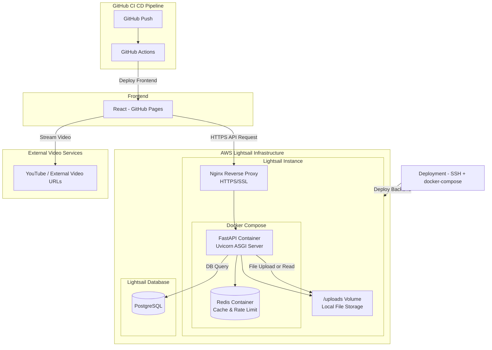

# BootRun (부트런)

> i5 Team Project: 강사와 수강생이 함께 성장하는 학습 플랫폼

## 팀원 소개

- 프론트엔드: 김규호(팀장), 김민주, 김채현
- 백엔드: 신가람, 장민경

## 1. 프로젝트 링크

- **Live Demo (GitHub Pages):** [`https://i5-team.github.io/bootrun-frontend/`](https://i5-team.github.io/bootrun-frontend/)
- **Back-End API (Swagger):** [`https://bootrun-backend.duckdns.org/docs`](https://bootrun-backend.duckdns.org/docs)
- **GitHub (Front-End):** [`https://github.com/i5-team/bootrun-frontend`](https://github.com/i5-team/bootrun-frontend)
- **GitHub (Back-End):** [`https://github.com/i5-team/bootrun-backend`](https://github.com/i5-team/bootrun-backend)
- **관리자 계정(테스트):**
  - ID: admin@bootrun.com
  - PW: adminSecureI5!
- **수강자 계정(테스트):**
  - ID: test@bootrun.com
  - PW: Test1234!@

## 2. 프로젝트 개요 (Introduction)

### 2-1. 프로젝트 컨셉 (Why We Built It)

> "강사와 수강생이 함께 성장하는 실무 중심의 학습 플랫폼"

저희 i5팀은 인프런, 클래스101과 같은 기존 이러닝 플랫폼을 벤치마킹하되, 일방적인 영상 시청을 넘어 **체계적인 학습 관리(LMS)**와 **강사-수강생 간의 소통**이 가능한 전문 플랫폼을 구축하고자 했습니다.

특히 **구체적인 실무 역량**을 기를 수 있는 강의에 초점을 맞춘, 강사와 수강생이 **서로 공존할 수 있는 공간**을 만드는 것이 목표였습니다.

### 2-2. 주요 기능 (What We Built)

#### (핵심) 강의실

영상 이어보기, 진행률 자동 저장, 강의 완료 처리, 커리큘럼 트래킹

- **강의실 > 진행률 - Progress Bar**
<video src="https://github.com/user-attachments/assets/26e4ac6e-7496-4273-8371-f2ae8c37ba79"></video>

- **강의실 > 자료 다운로드 링크 이동**
<video src="https://github.com/user-attachments/assets/b0678a05-0ed3-488c-937c-e3c6886501f1"></video>


#### 강의

강의 목록(필터링), 강의 상세, 수강 신청

- **강의 > 강의 목록 필터링**
<video src="https://github.com/user-attachments/assets/08360770-bbdc-4b76-8b90-d0ef007fef31"></video>

- **강의 > 강의 상세 조회**
<video src="https://github.com/user-attachments/assets/112d6fb3-f893-41bc-bfd1-e8824f190d66"></video>

- **강의 > 수강 신청**
<video src="https://github.com/user-attachments/assets/d7ad3960-9626-4653-9f11-8f8a9c635aeb"></video>


#### 인증

회원가입(이메일 인증), 로그인(JWT)

- **회원가입**
<video src="https://github.com/user-attachments/assets/fd39c8cc-ecac-42a8-afb0-9a26b2824130"></video>


- **로그인 > 수강생, 관리자**
<video src="https://github.com/user-attachments/assets/83fe11a7-bfcb-4467-bd93-2a0b42c7bbb3"></video>

#### 마이페이지

내 강의 목록, 프로필 수정(이미지 업로드/삭제), 계정 관리(비밀번호 변경/탈퇴)

- **마이페이지 > 프로필 설정**
<video src="https://github.com/user-attachments/assets/02787e1c-ff44-4f71-aaa9-f8726c1c847b"></video>

- **마이페이지 > 비밀번호 변경/탈퇴**
<video src="https://github.com/user-attachments/assets/5e1a9ed6-fa76-4d9a-b4cf-289f3d7e3c8e"></video>

#### 관리자

대시보드, 강의/사용자/결제 내역 관리

- **관리자 > 대시보드**
<video src="https://github.com/user-attachments/assets/e28784d0-a656-4246-b1cf-a5e7fe81b914"></video>

- **관리자 > 강의 관리 > 강의 추가 및 조회**
<video src="https://github.com/user-attachments/assets/dbd45c34-305c-412d-b584-07b04e60407f"></video>

- **관리자 > 강의 관리 > 수정 및 삭제, 공개 변경**
<video src="https://github.com/user-attachments/assets/d96a0806-0b50-4b28-a0a0-0cd167bcc9d1"></video>

- **관리자 > 결제 관리 > 결제 내역 엑셀 다운로드**
<video src="https://github.com/user-attachments/assets/72932412-a053-4c36-bb8b-4558f8930bd4"></video>

- **관리자 > 사용자 관리 > 조회**
<video src="https://github.com/user-attachments/assets/580fa5b1-3e6b-4bca-8d37-c71a2c0c7d56"></video>

### 2-3. 백엔드 핵심 설계

- **API 아키텍처**: 비동기 처리(AsyncIO + AsyncPG), Router-Service 계층 분리
  - 고성능 비동기 데이터베이스 연결
  - FastAPI Depends를 활용한 의존성 주입
- **인증 및 보안**: JWT 토큰 기반 인증, 다중 보안 계층
  - Access/Refresh Token 분리, 토큰 타입 검증’
  - bcrypt 패스워드 암호화, Fernet 데이터 암호화
  - Redis 기반 Rate Limiting (API 요청 제한)
- **데이터 관리**: PostgreSQL + Redis 하이브리드 구조
  - AsyncPG를 통한 비동기 DB 연결 풀링
  - Redis 캐싱으로 반복 쿼리 성능 최적화
- **로깅 시스템**: 구조화된 로깅 및 보안
  - 민감정보 자동 감지 및 마스킹 (비밀번호, JWT, API 키, 카드번호 등)
  - Request ID 기반 요청 추적
  - 로테이션 파일 로깅 (크기/날짜 기반)
- **배포 환경**: Docker 컨테이너화, HTTPS 적용
  - AWS Lightsail 배포
  - Let's Encrypt SSL 인증서, DuckDNS 동적 DNS
  - Nginx 리버스 프록시

## 3. 기술 스택 (Technology Stack)

### 3-1. 아키텍처 다이어그램



### 3-2. ERD 다이어그램


### 3-3. Front-End

| 구분        | 기술                  | 핵심 사유                                                                                          |
| ----------- | --------------------- | -------------------------------------------------------------------------------------------------- |
| **Core**    | `React`, `TypeScript` | 컴포넌트 기반 개발과 안정적인 타입 시스템을 위해 채택.                                             |
| **State**   | `React Query`         | 서버 상태와 클라이언트 상태를 분리하고, 캐싱과 데이터 동기화(Optimistic Update)를 효율적으로 관리. |
| **Styling** | `Styled-components`   | `theme` 기반의 일관된 디자인 시스템과 컴포넌트 격리 스타일을 적용.                                 |
| **Routing** | `React Router DOM`    | SPA(Single Page Application)의 표준 라우팅 라이브러리.                                             |
| **API**     | `Axios`               | `interceptors`를 활용해 JWT 토큰 자동 주입 및 401 에러(토큰 만료) 공통 처리 구현.                  |

### 3-4. Back-End

| 구분      | 기술                                                                         | 핵심 사유                                                                                                                                    |
| --------- | ---------------------------------------------------------------------------- | -------------------------------------------------------------------------------------------------------------------------------------------- |
| **Core**  | `Python **3.x**`, `FastAPI **0.121**`, `Pydantic **2.12**`, `Loguru **0.7**` | **Python 기반 고성능 비동기** 웹 서버 구축. **Pydantic**으로 데이터 타입 안전성 및 자동 문서화 확보. **Loguru**로 구조화된 로깅 시스템 구현. |
| **DB**    | `PostgreSQL`, `SQLAlchemy 2.0`, `Alembic 1.17`, `asyncpg 0.30`               | **ACID 트랜잭션** 및 JSON 지원 DB 사용. ORM을 통한 타입 안전성 및 **고성능 비동기** DB 드라이버로 효율적인 데이터 접근 구현.                 |
| **Auth**  | `JWT (Python-Jose 3.5)`, `Bcrypt 5.0`, `Cryptography 46.0`                   | 상태 비저장 **토큰 인증** 방식 채택. Bcrypt로 안전한 **비밀번호 암호화** 및 Fernet으로 민감 데이터 보호.                                     |
| **Cache** | `Redis 7.0`                                                                  | **인메모리 캐싱**을 통한 API 응답 속도 향상 및 레이트 제한 구현.                                                                             |

### 3-5. Infra & CI/CD

| 구분                 | 기술                                                                         | 핵심 사유                                                                                                                                                              |
| -------------------- | ---------------------------------------------------------------------------- | ---------------------------------------------------------------------------------------------------------------------------------------------------------------------- |
| **Deploy(Back-End)** | `AWS (EC2, S3 RDS)`, `Uvicorn **0.38**`,`Gunicorn **23.0**`, `OpenTelemetry` | 업계 표준 **AWS 환경**에서 서버, 파일, DB를 분리하여 운영. `Uvicorn`/`Gunicorn`으로 **고성능 비동기** 서버 환경 구축 및 **`OpenTelemetry`**로 분산 추적 모니터링 구현. |
| **CI/CD**            | `GitHub Actions`                                                             | `dev` 브랜치 `push` 시, 자동으로 테스트, 빌드, GitHub Pages 배포가 실행되도록 파이프라인 구축.                                                                         |

## 4. 폴더 구조

### 4-1. frontend 폴더 구조

: 프론트엔드는 **MVVM(Model-View-ViewModel)** 패턴을 React 환경에 맞게 적용하여 **관심사를 명확히 분리**했습니다.

```Mermaid
graph TD

    %% View
    subgraph View["View"]
        V[SignUpPage.tsx - JSX]
    end

    %% ViewModel
    subgraph ViewModel["ViewModel"]
        VM[useSignUpForm.ts - Custom Hook]
    end

    %% Model
    subgraph Model["Model"]
        M_Query[useAuthQueries.ts - React Query]
        M_API[authApi.ts - Axios]
    end

    %% Server
    SVR[(FastAPI Server)]

    %% Flow
    V -->|1. 회원가입 버튼 클릭 - handleSignUp 호출| VM
    VM -->|2. 상태/핸들러 제공 - apiMessage, handleSignUp| V
    VM -->|3. API 호출 - mutate| M_Query
    M_Query -->|4. API 함수 실행 - mutationFn| M_API
    M_API -->|5. 서버 요청| SVR
    SVR -->|6. 응답 반환| M_API
    M_API -->|7. 데이터 전달| M_Query
    M_Query -->|8. 캐시 업데이트 및 훅 데이터 갱신| VM

```

- **View (View):** `pages/SignUpPage.tsx`
  - UI 렌더링과 사용자 입력만 담당하는 "껍데기"입니다.
- **ViewModel (뷰모델):** `hooks/useSignUpForm.ts`
  - View가 필요로 하는 모든 상태(e.g., `email`, `passwordError`), 비즈니스 로직(e.g., `handleSignUp`), API 호출(`mutate`)을 담당합니다.
- **Model (모델):** `api/authApi.ts`, `queries/useAuthQueries.ts`
  - 실제 API 통신(`axios`)과 데이터 캐시(`React Query`)를 담당합니다.

이 구조 덕분에 `SignUpPage` 컴포넌트는 UI 렌더링에만 집중할 수 있었고, 로직은 `useSignUpForm` 훅으로 분리되어 테스트와 유지보수가 용이해졌습니다.

```
## frontend 폴더구조
bootrun-frontend
src/
├── api/          # (Model) Axios API 함수
├── assets/       # 아이콘, 이미지, 로고
├── components/   # (View) 재사용 가능한 공통 컴포넌트
├── constants/    # (View) 상수
├── hooks/        # (ViewModel) 공통 로직 훅
├── layouts/      # (View) 페이지 레이아웃 컴포넌트
├── pages/        # (View) 라우팅되는 페이지 컴포넌트
│   ├── About/
│   ├── Admin/
│   ├── Auth/
│   ├── Lecture/
│   └── MyPage/           # 페이지 하위 폴더 구조
│       ├── components/   # (View) 페이지 전용 컴포넌트
│       ├── constants/    # (View) 페이지 전용 상수
│       ├── hooks/        # (ViewModel)  페이지 전용 훅
│       ├── pages/        # (View) 페이지 컴포넌트
│       └── styles/       # 페이지 전용 스타일, 테마
├── queries/      # (Model/ViewModel) React Query 훅
├── router/       # 라우터 설정
├── styles/       # 전역 스타일, 테마
├── types/        # 전역 타입 정의
├── utils/        # (Model) 순수 유틸 함수
├── App.tsx       # 메인 App 컴포넌트
├── index.css     # 전역 CSS Entry
└── main.tsx      # React DOM 렌더링 Entry
```

### 4-2. Backend 폴더구조

: 백엔드는 계층별 책임 분리를 통해 코드의 유지보수성과 테스트 가능성을 확보했습니다.

```mermaid
graph TD
    %% Router Layer
    subgraph Router["Router Layer - 라우터"]
        R[auth.py<br/>API 엔드포인트 정의]
    end
    
    %% Service Layer
    subgraph Service["Service Layer - 서비스"]
        S[user_service.py<br/>비즈니스 로직 처리]
    end
    
    %% Data Layer
    subgraph Data["Data Layer - 데이터"]
        Schema[schemas/user.py<br/>Pydantic 스키마]
        Model[models/user.py<br/>SQLAlchemy 모델]
    end
    
    %% Database
    DB[(PostgreSQL)]
    
    %% Flow
    Client[Client Request]
    
    Client -->|1. POST /api/v1/auth/signup| R
    R -->|2. 요청 데이터 검증| Schema
    R -->|3. 비즈니스 로직 호출| S
    S -->|4. 데이터 처리| Schema
    S -->|5. DB 작업 요청| Model
    Model -->|6. SQL 쿼리 실행| DB
    DB -->|7. 결과 반환| Model
    Model -->|8. 데이터 변환| S
    S -->|9. 응답 생성| Schema
    Schema -->|10. JSON 응답| R
    R -->|11. HTTP Response| Client
 ```

- **Router (라우터):** `routers/auth.py`, `routers/admin/dashboard.py`
  - HTTP 요청을 받아 적절한 서비스로 라우팅하는 "진입점" 역할을 합니다.
  - 요청 검증(Pydantic Schemas)과 응답 포맷 담당을 담당합니다.
- **Service (서비스):** `services/user_service.py`
  - 모든 비즈니스 로직과 데이터 처리 로직이 집중된 계층입니다.
  - 데이터베이스 쿼리, 캐시 조회, 외부 API 호출 등을 조율합니다.
  - 재사용 가능한 로직을 제공하여 테스트가 용이합니다.
- **Model & Schema (모델/스키마):** `models/user.py`, `schemas/user.py`
  - **Model:** SQLAlchemy ORM 모델로 데이터베이스 테이블을 정의합니다.
  - **Schema:** Pydantic으로 요청/응답 데이터 검증 및 직렬화를 합니다.
- **Core (핵심 인프라):** `core/database.py`, `core/security.py`
  - 데이터베이스 연결, JWT 인증, 캐시 관리 등 공통 기능을 제공합니다.

이러한 구조로 라우터는 HTTP 처리에만 집중하고, 비즈니스 로직은 서비스에서 관리되어 **테스트 및 수정이 간편**합니다.

```
## backend 폴더구조
bootrun-backend/
├── app/
│   ├── main.py                 # FastAPI 앱 진입점, 라우터 등록, 미들웨어 설정
│   │
│   ├── core/                   # 핵심 설정 및 의존성
│   │   ├── config.py           # 환경 변수 및 설정 관리
│   │   ├── database.py         # PostgreSQL 연결 및 세션 관리
│   │   ├── redis.py            # Redis 캐시 초기화 및 관리
│   │   ├── security.py         # JWT 토큰 생성/검증, 비밀번호 해싱
│   │   ├── dependencies.py     # FastAPI 의존성 주입 
│   │   └── logging_config.py   # 구조화된 로깅 설정 
│   │
│   ├── models/                 # SQLAlchemy ORM 모델
│   │   ├── base.py             # 기본 모델 클래스
│   │   ├── user.py             # 사용자 모델
│   │   ├── course.py           # 강의, 챕터, 강의 영상 모델
│   │   ├── payment.py          # 결제 정보 모델
│   │   └── progress.py         # 수강 등록 및 학습 진행률 모델
│   │
│   ├── schemas/                # Pydantic 요청/응답 스키마
│   │   ├── user.py             # 사용자 스키마
│   │   ├── course.py           # 강의 스키마
│   │   ├── enrollment.py       # 수강 등록 스키마
│   │   ├── payment.py          # 결제 스키마
│   │   ├── admin.py            # 관리자 대시보드 응답 스키마
│   │   └── common.py           # 공통 응답 스키마 
│   │
│   ├── routers/                # API 엔드포인트
│   │   ├── auth.py             # 인증 API 
│   │   ├── user.py             # 사용자 API 
│   │   ├── course.py           # 강의 조회 API 
│   │   ├── enrollment.py       # 수강 등록 API
│   │   ├── payment.py          # 결제 API 
│   │   └── admin/              # 관리자 API
│   │       ├── dashboard.py    # 대시보드 통계 API
│   │       ├── users.py        # 사용자 관리 API
│   │       ├── courses.py      # 강의 관리 API 
│   │       └── payments.py     # 결제 관리 API 
│   │
│   ├── services/               # 비즈니스 로직 계층
│   │   ├── user_service.py                 # 사용자 서비스
│   │   ├── course_service.py               # 강의 조회 서비스
│   │   ├── enrollment_service.py           # 수강 등록 서비스
│   │   ├── payment_service.py              # 결제 서비스
│   │   ├── admin_dashboard_service.py      # 관리자 대시보드 서비스
│   │   ├── admin_user_service.py           # 관리자 사용자 관리 서비스
│   │   └── admin_course_service.py         # 관리자 강의 관리 서비스
│   │
│   ├── middleware/             # 미들웨어
│   │   └── rate_limit.py       # API 요청 속도 제한
│   │
│   ├── exceptions/             # 커스텀 예외 처리
│   │   └── responses.py        # 표준화된 에러 응답 
│   │
│   └── utils/                  # 유틸리티 함수
│       └── file_utils.py       # 파일 업로드/삭제 유틸   
│
├── alembic/                    # 데이터베이스 마이그레이션
│   ├── versions/               # 마이그레이션 버전 파일
│   └── env.py                  # Alembic 환경 설정
│
├── scripts/                    # 운영 스크립트
│   └── recalculate_progress_rates.py  # 진행률 재계산 스크립트
│
├── docs/                       # 프로젝트 문서
│   └── FOLDER_STRUCTURE.md            # 폴더 구조 문서
│
├── uploads/                    # 로컬 파일 저장 디렉토리
│   ├── thumbnails/             # 강의 썸네일 이미지
│   ├── instructors/            # 강사 프로필 이미지
│   └── profiles/               # 사용자 프로필 이미지
│
├── logs/                       # 로그 파일
│   ├── app.log                 # 애플리케이션 로그
│   └── error.log               # 에러 전용 로그
│
├── docker-compose.yml          # Docker Compose 설정
├── Dockerfile                  # Docker 이미지 빌드 설정
├── .dockerignore               # Docker 빌드 시 제외 파일
├── requirements.txt            # Python 패키지 의존성
├── alembic.ini                # Alembic 설정 파일
├── .env                       # 환경 변수 
├── .env.example               # 환경 변수 예제
├── .gitignore                 # Git 제외 파일 목록
├── deploy-ec2.sh              # EC2 배포 스크립트
├── update-deployment.sh       # 배포 업데이트 스크립트
└── README.md                  # 프로젝트 README
```

## 5. 실행 방법 (Getting Started)

### 5-1. Front-End

**사전 요구 사항:** `Node.js` (v20 이상 권장)

```
# 1. 저장소 클론
git clone https://github.com/I5-Team/bootrun-frontend.git

cd bootrun-frontend

# 2. 의존성 설치
npm install

# 3. 환경 변수 설정
.env.development 파일을 생성하고 환경 변수 설정
VITE_API_BASE_URL="[백앤드 API 서버 주소]"

# 4. 개발 서버 실행
npm run dev

```

### 5-2. Back-End

**사전 요구 사항:** `Docker`, `Docker Compose`

```
# 1. SSH로 Lightsail 서버 접속
ssh -i ~/.ssh/lightsail-key.pem ubuntu@YOUR_IP

# 2. 저장소 클론
git clone https://github.com/I5-Team/bootrun-backend.git
cd bootrun-backend

# 3. 환경 변수 설정
cp .env.example .env
nano .env 

# 4. Docker Compose 실행
docker-compose up -d --build

# 5. 확인
docker-compose ps
```

## 6. 협업 규칙 (Collaboration Rules)

### 6-1. Git 브랜치 전략 (Git-flow)

- **`main`**: 최종 배포 버전
- **`dev`**: 개발 서버 (CI/CD 자동 배포)
- **`feat/{작업이름}`**: 기능 개발 (e.g., `feat/lecture-room`)
- **규칙:** `main`과 `dev` 브랜치에는 절대 직접 `push`하지 않습니다. 모든 작업은 `feat` 브랜치에서 진행 후, `dev`로 **Pull Request(PR)**를 생성하여 코드 리뷰를 거칩니다.

### 6-2. 커밋 메시지 (Commit Message)

| Gitmoji | **커밋 type** | 설명                                               |
| ------- | ------------- | -------------------------------------------------- |
| ✨      | feat          | 새 기능 추가                                       |
| 🗃️      | db            | DB: DB 스키마, 마이그레이션, 쿼리 변경             |
| 🔐      | auth          | Auth 관련: 인증/인가 로직 추가 및 수정             |
| 🌐      | api           | API 관련: API 엔드포인트 추가/변경                 |
| 🎨      | style         | UI 수정 (CSS/스타일/레이아웃)                      |
| ✅      | test          | 테스트 관련                                        |
| ♿️      | a11y          | 접근성 개선                                        |
| 🐛      | fix           | 기능/버그 수정                                     |
| **🔨**  | server        | Server 관련: 서버 설정, 미들웨어, 인프라 코드 변경 |
| ⚡️     | perf          | 성능 개선 (최적화, SEO 등)                         |
| ♻️      | refactor      | 코드 리팩토링 (기능 변경 X)                        |
| 📦      | chore         | 빌드 시스템, 환경설정 관련                         |
| 🔥      | remove        | 불필요한 코드/파일 삭제                            |
| 🍱      | asset         | 리소스 파일 관리                                   |
| 🚀      | deploy        | 배포 관련                                          |
| 📝      | docs          | 코드 외 문서 관련 / 오타 수정                      |

### 6-3. 그라운드 룰 (Ground Rules)

1. **회의:** 오전 10시 30분, 오후 3시 30분 (ZEP C3 열정 방)
2. 칭찬 감옥(월, 수, 금 오후 회의 이후)
3. 팀장에게 너무 의존하지 말기
4. 회의 시간 준수
5. 적극적 소통하기
6. **git 브랜치 전략 준수**
   1. **Git 브랜치 전략 : main(배포용) / develop(테스트용) / feature(기능단위 작업),**
   2. **PR(Pull Request)은 최소 1명 이상의 리뷰**를 받아야 Merge할 수 있습니다.
   3. `dev` 브랜치로 Merge 하기 전, 반드시 `dev`의 최신 변경사항을 `pull` 받아 로컬에서 테스트합니다.
7. 이슈 관리 : Git, GitHub Issue, Pull Request(PR) 작성 규칙에 따라 작업
8. 개발 규칙 : 코딩 컨벤션 통일
9. 답변은 가능하면 빠르게 하기

## 7. 핵심 트러블슈팅 (Troubleshooting)

프로젝트 진행 중 발생했던 주요 문제와 해결 과정입니다.

1. **[HTTPS/HTTP 혼합 콘텐츠]**
   - **문제:** GitHub Pages(`https://`) 배포 후, `http://` API 요청이 브라우저 보안 정책으로 차단됨.
   - **해결:** 백엔드 팀과 협의, API 서버에 **Let's Encrypt** SSL 인증서를 적용하여 `https://` 엔드포인트로 변경.
2. **[React Query 캐시 동기화]**
   - **문제:** `ProfilePage`에서 닉네임을 변경해도 `Header` 컴포넌트의 닉네임이 바뀌지 않음.
   - **해결:** `useProfile` 훅이 동일한 쿼리 키(`userKeys.me`)를 구독하게 하고, 수정(Mutation) `onSuccess`에서 `setQueryData` (즉각 반영) 및 `invalidateQueries` (백그라운드 동기화)를 호출하여 모든 구독 컴포넌트를 자동으로 갱신.
3. **[Axios 401 무한 루프]**
   - **문제:** 토큰 갱신(Refresh) API 요청이 실패(401)하자, 응답 인터셉터가 이를 다시 감지해 `refresh` API를 무한 호출함.
   - **해결:** 인터셉터 예외 처리에 `refresh`, `logout` API 경로를 추가하여 무한 루프 방지.
4. **[transaction_id(거래 ID)의 빈값 발생]**
   - **문제**: 결제 생성 성공 데이터에 `transaction_id`를 빈 문자열(” ”)로 반환됨. (결제 확인 조회 시 `transaction_id` 필요)
   - **해결**: UUID 모듈 추가, 결제 생성 시 응답에서 `transaction_id`를 반환하도록 수정
5. **[결제/환불 API 시간대(Timezone)]**
   - **문제**: `datetime` 필드가 UTC(0시간)로 형식 반환되어 실제 한국 시간보다 다르게 표시됨
   - **해결**: Pydantic `@field_serializer`로 모든 `datetime` 필드를 KST(UTC+9)로 변환
6. **[동적 경로 비교 에러]**
   - **문제**: 동적 경로 패턴(/lectures/:id/room)과 실제 URL(/lectures/1/room)을 문자열로 직접 비교하면 항상 false가 됨
   - **해결**: const isLectureRoomPage = /^\/lectures\/\d+\/room/.test(location.pathname); 정규식을 사용한 패턴 매칭으로 해결
7. **[강의 진도 저장 API 404 에러 처리]**
   - **문제**: `PATCH /enrollments/progress/lectures/:id` 호출 시 간헐적으로 404가 발생하여, 프론트의 `progressExists` 상태와 서버 기록이 불일치하는 문제가 생김.
   - **해결**: `enrollmentsApi.ts`에서 404 응답을 명시적으로 throw하도록 변경하고, `LectureRoomPage`에서 해당 예외를 `catch`한 뒤 `POST` API로 재시도하도록 처리하여 최초 진행률 데이터가 안전하게 생성되도록 함.
8. **[SQLAlchemy Enum 타입 매핑 오류]**
   - **문제**: `SQLEnum(Gender)` 사용 시, 데이터베이스에 Enum의 `name`이 저장되어야 하는데 `value`가 저장되거나, Alembic 마이그레이션 시 Enum 타입이 제대로 인식되지 않는 오류 발생.
   - **해결**: `values_callable=lambda obj: [e.value for e in obj]` 파라미터를 추가하여 Enum 객체의 실제 `value` 값을 명시적으로 데이터베이스에 저장하도록 설정. 이를 통해 Python Enum과 데이터베이스 간 데이터 타입 불일치 문제 해결.
9. **[결제 결과 페이지 깜빡임 현상]**
   - **문제**: 결제 성공 시에도 초기 렌더링 단계에서 상태가 falsey로 설정되어 잠깐 결제 실패 화면이 노출됨.
   - **해결**: 강제 로딩 시간(300ms)을 주어 API 응답 전까지 로딩 상태를 유지하도록 수정, 성공/실패 화면은 로딩 이후에 렌더링되도록 개선.

# 8. 팀원

- **김규호 (Front-End, 팀장):** 프로젝트 총괄, 인증(로그인/회원가입), 마이페이지 개발, CI/CD 구축 및 관리
- **김민주 (Front-End):** 강의 목록, 강의 상세 페이지, UI/UX 디자인 시스템, SEO 및 웹 접근성 구축, 사용자 결제 관리
- **김채현 (Front-End):** 강의실 페이지, 학습 관리(진행률) 기능, 관리자(대시보드, 강의관리, 결제관리, 사용자관리)
- **신가람 (Back-End):** DB 설계, 인증/사용자/강의/학습 진행/관리자(강의) API 개발, 서버 배포   
- **장민경 (Back-End):** 환경 설정(env/config), 결제/관리자(사용자·결제·대시보드) API 개발, 로컬 서버 구축  

# 9. 소감

- ## 김규호
  -   - 팀장으로서 프로젝트를 리딩하면서 새로운 관점에서의 업무를 수행해 보았고, 각 팀원들의 적극적인 태도와 협업이 있었기에 이러한 결과를 낼 수 있었다고 생각하고, 팀장의 기회를 주신 팀원들께 감사드립니다.
- ## 김민주
  - 팀 프로젝트를 진행하며 초기 개발 환경 세팅과 코드 컨벤션 등 협업 기준을 직접 설정하고 관리하며 팀원들과 소통하고, 협업 효율과 프로젝트 일관성을 유지하는 방법을 배울 수 있었습니다. 또한, 백엔드와 프론트엔드를 동시에 개발하며 정리되지 않은 데이터를 처리하고 가공하는 경험을 통해 데이터 구조를 이해하고 안정적인 기능을 구현하는 능력을 키울 수 있었습니다.
- ## 김채현
  - 이번 프로젝트를 통해 다양한 배경을 가진 팀원들과 함께 협업할 수 있었습니다.
    백엔드 지식이 깊은 분, 디자인 감각이 뛰어난 분, 실제 현업 경험이 있는 분들과 함께하며
    서로의 강점을 배우고 실제 서비스를 만들어가는 과정이 큰 성장 경험이 되었습니다.
- ## 신가람
  - 팀 프로젝트를 통해 협업 방식과 소통 방법, 그리고 함께 문제를 해결하는 과정을 깊이 경험할 수 있었습니다. 개발 환경 설정부터 아키텍처 설계, 그리고 프론트엔드와의 API 연동까지 진행하면서, 개발이 어떤 의미를 가지며 어떤 흐름으로 이루어지는지 많이 배울 수 있던 시간이었습니다.
- ## 장민경
  - 저희 팀은 꾸준히, 그리고 밀접하게 소통하였고 팀원 각자가 자신의 역할에 높은 책임감과 열정을 가지고 임한 덕분에 저도 어려운 문제들을 포기하지 않고 해결하며 프로젝트를 성공적으로 완수할 수 있었습니다.
